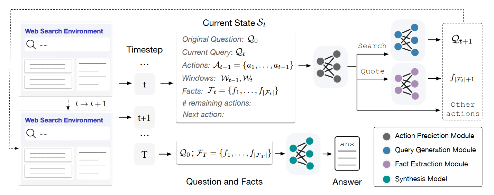
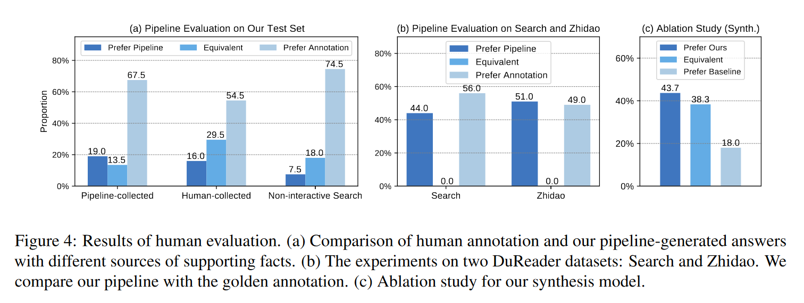

# WEBCPM: Interactive Web Search for Chinese Long-form Question Answering

### 一句话概括

> [!IMPORTANT]
>
> 提出了第一个中文LFQA数据集，并训练了一个能使用web search的模型 ，更有效解决了长而复杂的问题

### 文章思路流程

1. #### 待解决问题：

   > 创建开源的，善于使用web search来解决LFQA问题的模型

2. #### 先前方法问题

   - 一般分成两步：**information retrieval** + **information synthesis**

     也就是先搜索，再根据搜索的内容来回答

   - 只做一次搜索会导致搜索的内容广而不精确

   - 没有把复杂问题分解成小问题的能力

   - 先前的工作，比如**WebGPT**不开源

3. #### 解决方法

   

   - [ ] **Dataset**：建造一个interface，人为解决问题并用这个接口记录标注人的行为，将他们汇总变成**WebCPM**

     > 数据格式：we collect 5, 500 instances, each formatted in a tuple of (question, web search behavior, supporting fact, answer)

   - [ ] **Search Model**：(分别训练分别评估)

     1. action prediction
     2. search query generation
     3. supporting fact extraction

     > [!NOTE]
     >
     > 每一步的状态转移的都是按照现在的状态进行预测的
     > $$
     > \mathcal{P}(\mathrm{Search}| \mathcal{S}_t) = \mathcal{P}(x_1 | \mathcal{S}_t) \times \prod_{i=2}^N\mathcal{P}(x_i | \mathcal{S}_t, x_1, \ldots, x_{i-1}).
     > $$
     >

   - [ ] **Synthesis Model**：

     会混一点无关数据来提升模型效能

### 实验结果

### 思考

1. 这个工作还是text only的，并没有涉及其他的模态
