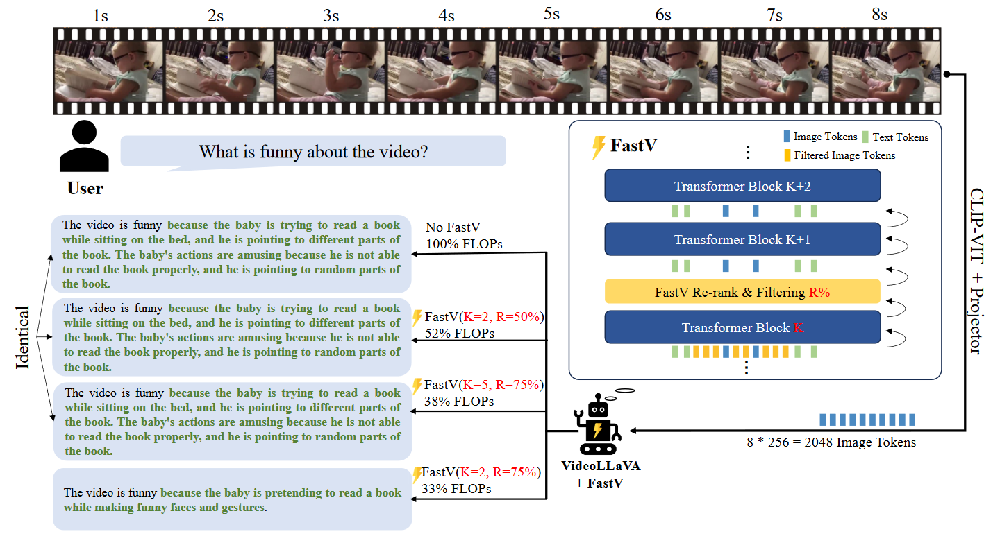
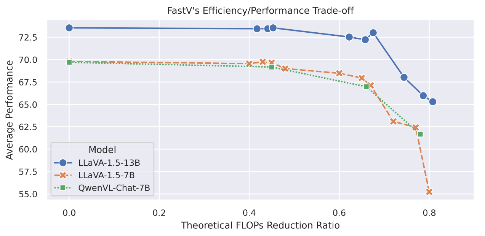
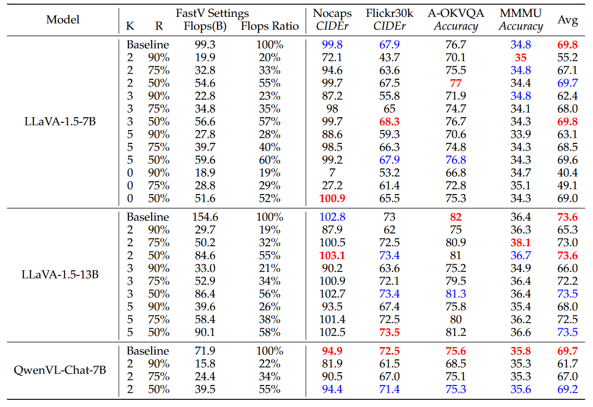

# An Image is Worth 1/2 Tokens After Layer 2: Plug-and-PLay Acceleration for VLLM Inference

### 一句话概括

> [!IMPORTANT]
>
> Large Vision-Language Model最近很受关注，但是在计算image tokens和text tokens之间的attention的时候是低效的，这导致没有办法处理更大的image。这篇文章提出了一种方法**FastV**，通过把attention layer中的部分低效的（和其他attention计算比较低的）参数去掉，即插即用，从而进行效率提升。

### 文章思路流程

1. #### 待解决问题：

   > - image tokens在深层attention layer中激活程度很低
   > - 当前的Large Vision-Language Models的image token数量会随着image shape的增大而急剧增大
   > - 虽然在ViTs中有些token去冗余的工作，但是在LVLMs中还没有类似工作

2. #### 先前方法问题

   - 这篇文章之前在LVLMs并没有很多工作去做token去冗余

3. #### 假设

   > To address the problem, we assume a plausible explanation is that the high redundancy in visual signals leads to the aggregation of image-related, instruction-specific features onto certain “anchor” tokens through the self-attention mechanism in the shallow layers. Notably, these anchor tokens are not image tokens. In deep layers, attentions are focused on those anchor tokens, leading to significantly reduced attention on the image tokens themselves.

   image token并不直接和transformer相关，中间有个anchor token的中间过程

4. #### 解决方法

   

   > We simply compute the average attention-score one token received from all other tokens as the criteria φattn in our experiment

   FastV可以插入模型的任意一层中，在插入之前计算方式不变，插入之后按照toekn之间的attention-score做排序，消除一些不重要的token，再用剩下的这些token来做剩下的Block计算

   

### 实验结果

1. System prompt在注意力中占比比image或者user instruction显著的多

2. 浅层的attention分布比深层更平滑

### 思考

1. 在目前的模型中image tokens无论在浅层还是深层的attention占比都很小，image所包含的信息肯定会显著多余system prompt的，能否有新的编码方式来解决这个问题？
