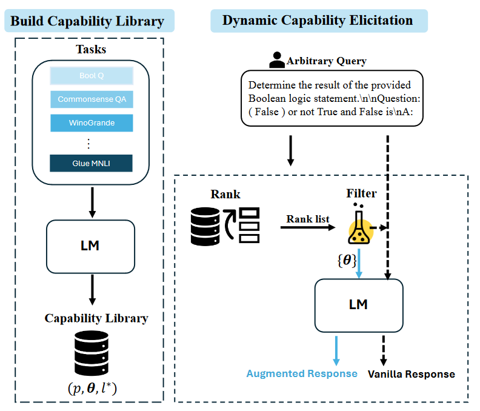
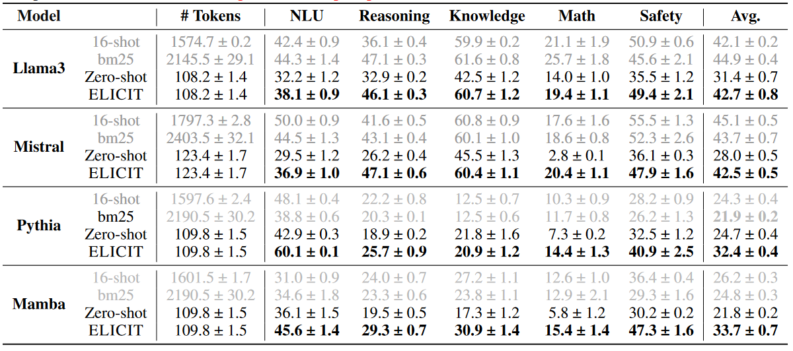

# ELICIT: LLM AUGMENTATION VIA EXTERNAL INCONTEXT CAPABILITY

### 一句话概括

> [!IMPORTANT]
>
> 对模型构建类似ICL的task token库，在inference的时候通过选取合适的task vector作用到合适的layer来影响模型的生成结果

### 文章思路流程

1. #### 待解决问题：

   > - ICL虽然有效但是耗的token多
   > - fine tuning虽然有效但是需要重新训练

2. #### 解决方法

   

   - 随机选取一些ICL丢到模型里，记录每一岑last token的task vector，在一些benchmark上做试验挑出来影响最大的layer。
   - 根据输入的问题训练一共小模型找和数据的相似度，选取对应的task vector和对应需要操作的layer进行参数变换，当置信分数高于一定阈值之后修改模型参数进行推理。

3. #### 数据集

   - Dynamic Layer Selection for l
   - 对应的task vector

4. #### 替换方式

   - 直接替换
     $$
     h_L = \theta_L
     $$
     

   - 差分替换（原文中用的这个，超参挑的2）
     $$
     h_L = h_L + \omega \times \theta_L
     $$
     

### 实验结果

1. 对**ICL**等问题进行了数学层面上的归纳
2. 在提高可解释性的同时，减少耗费的token数，且在推理时间消耗没有显著提升的情况下达到了和ICL类似的水平

### 思考

1. 每个vector库都是对一个特定模型做的，可迁移性是否需要考虑
1. 在**Relevant Task Vector Selection**步骤中用的是一个小模型做分类，能不能梯度或者优化器的状态来代表呢？

