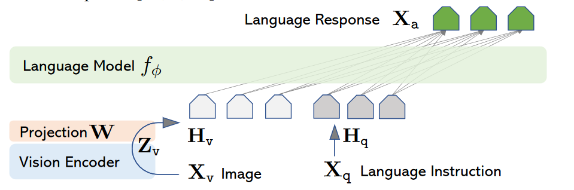
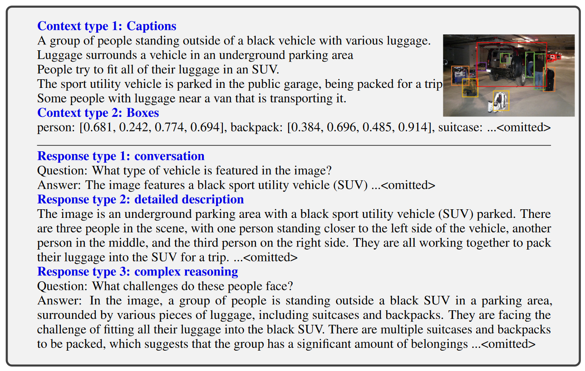
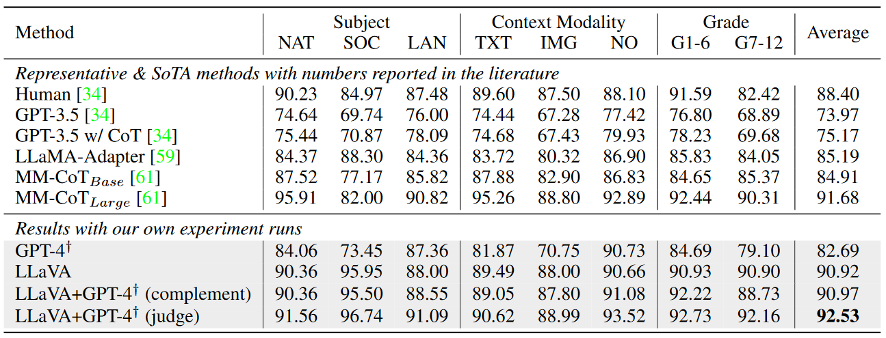

# Visual Instruction Tuning

### 一句话概括

> [!IMPORTANT]
>
> LLM在很多文本任务上显示了很好的泛化能力，这篇文章提出了**LLAVA**，一种端到端的模型将LLM迁移到了多模态的任务上。

### 文章思路流程

1. #### 待解决问题：

   > - 视觉的Instruction following agent要么是只针对某一个任务，要么是在LLM的帮助下集成多个模型，没有用一个模型适配多个任务的先例
   > - LLM只能解决文本任务，在图片-instruction上缺乏数据

2. #### 解决方法

   

   通过**CLIP**来对image进行编码，经过可学习的Projection 矩阵W将其投影到和word embedding相同的向量空间上，再将编码好的token作为输入让LLM进行学习。

3. #### 数据集

   

   - 首先，对于每一张图片，都可以很容易想到有：图片本身（${X_v}$），图片相关标注（${X_c}$）和图片相关问题（${X_q}$​）
   - 但是这样标注耗时耗力而且信息不全，所以本文使用了先用**Caption**和**Boxes**描述图片，输入**GPT4**中让他回答其中的各种问题来作为数据

### 实验结果

### 思考

1. 这个模式只解决了输入是image加文本的情况，输出还限制在文本这一范围内

