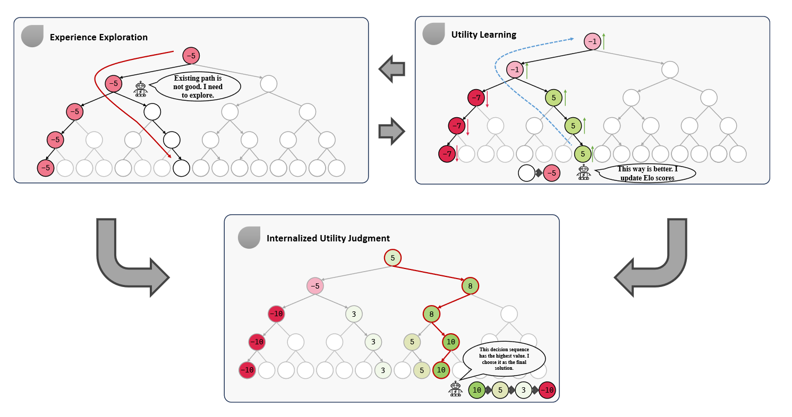
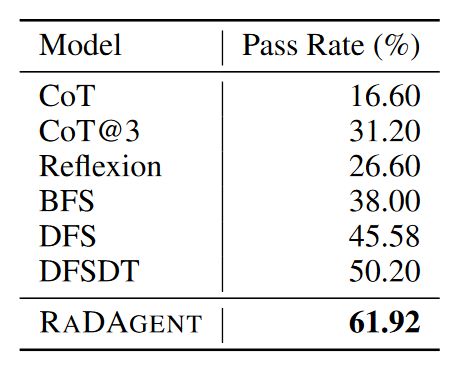

# RATIONAL DECISION-MAKING AGENT WITH INTERNALIZED UTILITY JUDGMENT

### 一句话概括

> [!IMPORTANT]
>
> 提出了一种不依靠人工打分的、自我探索的框架，让RaDAgent能从复杂任务中通过迭代的方式选出最优策略。实际上和之前在TooLLLM里面提出的**DFSDT**很像，相当有用一种评分比较机制把DFS换掉了，启发式的搜索最终答案。

### 文章思路流程

1. #### 待解决问题：

   > - 现实世界中很多任务都很难找到合适的人工评判方法（may be unavailable, flawed, or even erroneous）。
   
2. #### 解决方法

   

   - 通过迭代的方式，交替进行**Experience Exploration**与**Utility Learning**，从而找到最优解

### 实现细则：

1. #### Elo Rating System

   - 每个d（决策）都有一个初始分数，比较的时候遵循下面的公式更新分数，简单来说就是出现概率越小的事情分数变动越大。
     $$
     E_{x>y} = \frac{1}{1 + e^{-\frac{v_x-v_y}{r}}}
     $$

     $$
     R_{x>y} = \begin{cases} 
     1, & \text{if }x\text{ win} \\
     0, & \text{if }y\text{ win} \\
     0.5, & \text{otherwise}
     \end{cases}
     $$

     $$
     v_x = v_x + K * (R_{x>y} - E_{x>y})
     $$

     $$
     v_y = v_y + K * (R_{y>x} - E_{y>x})
     $$

     

2. #### Experience Exploration

   - 把决策过程看成马尔科夫链，每次决策只和上次决策有关

   - 得到决策的概率分布后，为了防止陷入局部最优，增加了${\hat{d}}$来代表**探索新的路径**，并赋予其初始分数参与决策

   - 最后用softmax来确定下一个d是什么
     $$
     P(d_i) = \frac{\exp(\frac{v_i}{\tau})}{\sum_j \exp(\frac{v_j}{\tau})}, d_i \in \{d_1, d_2, \cdots, d_n, \hat{d}\}
     $$
     

3. #### Utility Learning

   - 在所有的d中随机采样，将选出来的${d_{i}}$同当前的d相比较，计算**Elo**结果，更新分数

   - 为了避免出现提问顺序影响结果的事情发生，这边比了两次
     $$
     R_{x>y} = \begin{cases} 
     1, & \text{if }t_{n}\text{ win twice} \\
     0, & \text{if }t_{i}\text{ win twice} \\
     0.5, & \text{otherwise}
     \end{cases}
     $$
     

### 实验结果

> 算是这篇文章好的地方吧，试验结果显著的优于之前的方法

### 思考

