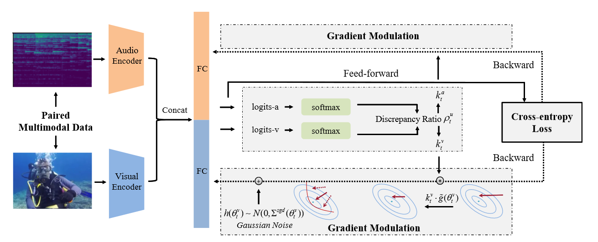
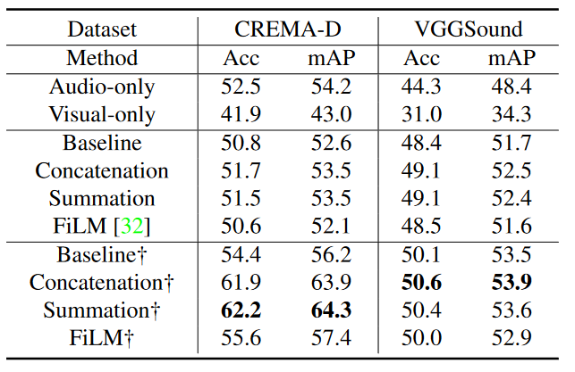

# Balanced Multimodal Learning via On-the-fly Gradient Modulation

### 一句话概括

> [!IMPORTANT]
>
> 目前的多模态模型在某些情况下的能力会不如一些单模态模型，文章猜测可能因为一个模态的更新占了主导，导致其他模态并没有被完全训练。作者提出了一种**OGM-GE**方法，通过在模型中动态更改不同模态的学习率，来对齐不同模态的训练进度。

### 文章思路流程

1. #### 待解决问题：

   > 不同的模态会以不同的速度converge，这会导致训练端到端的多模态模型时会有一些模态并没有被完全训练，造成模型能力下降。

2. #### 先前方法

   - **Gradient Blending**

   - **Distilling**

     > But extra efforts are required to introduce additional neural modules, which complicates the training procedure

3. #### 解决方法

   

   1. 不同模态数据经过一个fc层，计算对应的softmax值
   2. 通过计算两个输出的比率，动态的调整不同优化器的学习率
   3. 在调整完之后的优化器后面加Gaussian噪声

4. #### 方法亮点

   - [ ] 从数学上解释了为什么模型不会被同速率的训练

   - [ ] 不用另外对模型进行操作，而是一个即插即用的模块
   - [ ] 在对优化器进行操作之后加了gaussian noise来提高模型的泛化能力

### 公式推导

1. #### converge速率不同解释

   > f和L定义

   $$
   f(x_{i})=W[\varphi^{a}(\theta^{a},x^{a}_{i})]+W[\varphi^{v}(\theta^{v},x^{v}_{i})]+b
   $$

   $$
   L = -\frac{1}{N} \sum_{i=1}^N \log \frac{e^{f(x_i)_{y_i}}}{\sum_{k=1}^M e^{f(x_i)_k}}
   $$

   > $${W_{t+1}^a}$$更新推导

   
   $$
   W_{t+1}^a = W_t^a - \eta\nabla_{W^a}L(W_t^a)
   $$

   $$
   = W_t^a - \eta\frac{1}{N}\sum_{i=1}^N \frac{\partial L}{\partial f(x_i)}\frac{\partial f(x_i)}{\partial W^a}
   $$

   $$
   =W_t^a - \eta\frac{1}{N}\sum_{i=1}^N \frac{\partial L}{\partial f(x_i)}\varphi^a(\theta^a, x_i^a)
   $$

   > $${\theta}$$同理

   $$
   \theta_{t+1}^a = \theta_t^a - \eta\nabla_{\theta^a}L(\theta_t^a)
                   = \theta_t^a - \eta\frac{1}{N}\sum_{i=1}^N \frac{\partial L}{\partial f(x_i)}\frac{\partial(W_t^a \cdot \varphi_t^a(\theta^a, x_i^a))}{\partial\theta_t^a}
   $$

   > 唯一交叉项化简

   $$
   \frac{\partial L}{\partial f(x_i)_c} = \frac{e^{(W^a \cdot \varphi_i^a + W^v \cdot \varphi_i^v + b)_c}}{\sum_{k=1}^M e^{(W^a \cdot \varphi_i^a + W^v \cdot \varphi_i^v + b)_k}} - 1_{c=y_i}
   $$

2. #### **On-the-fly gradient modulation（解决方法）**

   > 基本思想：
   >
   > 使用SGD，在updata的时候在前面乘一个系数，这个系数受到模型激活程度的影响

   - ratio表示
     $$
     s_i^a = \sum_{k=1}^M 1_{k=y_i} \cdot \text{softmax}(W_t^a \cdot \varphi_t^a(\theta^a, x_i^a) + \frac{b}{2})_k
     $$

     $$
     s_i^v = \sum_{k=1}^M 1_{k=y_i} \cdot \text{softmax}(W_t^v \cdot \varphi_t^v(\theta^v, x_i^v) + \frac{b}{2})_k
     $$

     $$
     \rho_t^v = \frac{\sum_{i\in B_t} s_i^v}{\sum_{i\in B_t} s_i^a}
     $$

   - 更新速度调整
     $$
     k_t^u = \begin{cases} 
     1 - \tanh(\alpha \cdot \rho_t^u) & \rho_t^u > 1 \\
     1 & \text{others},
     \end{cases}
     $$

     $$
     \theta_{t+1}^u = \theta_t^u - \eta \cdot k_t^u\tilde{g}(\theta_t^u).
     $$

   - 泛化能力增强（添加Gaussion）

     > 原始的batch sample sgd服从Gaussian分布

     $$
     \tilde{g}(\theta_t^u) \sim \mathcal{N}(\nabla_{\theta^u} L(\theta_t^u), \Sigma^{sgd}(\theta_t^u))
     $$

     $$
     \Sigma^{sgd}(\theta_t^u) \approx \frac{1}{m}[\frac{1}{N}\sum_{i=1}^N \nabla_{\theta^u} \ell(x_i; \theta_t^u)\nabla_{\theta^u} \ell(x_i; \theta_t^u)^T 
     - \nabla_{\theta^u} L(\theta_t^u)\nabla_{\theta^u} L(\theta_t^u)^T]
     $$

     

     

### 实验结果

### 思考

1. #### 尝试推广到**adam**：

   > 动机：adam在模型训练上的应用比sgd更广

   - ##### Adam公式

     $$
     \theta^{t+1} - \theta^t = -\eta_t \Gamma(z, \theta^t)
     $$

     $$
     \Gamma(z, \theta^t) \triangleq \frac{m^{t+1}}{\sqrt{v^{t+1} + \epsilon}}
     $$

     $$
     m^{t+1} = (\beta_1 m^t + (1 - \beta_1)\nabla\ell(z; \theta^t))/(1 - \beta_1^t)
     $$

     $$
     v^{t+1} = (\beta_2 v^t + (1 - \beta_2)\nabla\ell(z; \theta^t)^2)/(1 - \beta_2^t)
     $$

   - ##### 尝试推导（这一步是为了后面补Gaussian的时候有变化）

     1. *计算${m^t}$​​​的variance*

        > [!NOTE]
        >
        > 先不看最后除的常数

        $$
        m^{t+1} = \beta_1 m^t + (1 - \beta_1)\tilde{g}(\theta_t^u)
        $$

        $$
        m^{t+1}=\beta_1^tm^0+\sum_{i=0}^t (1-\beta_1)\beta_1^{(t-i-1)}\tilde{g}(\theta_i^u)
        $$

        $$
        Var(m^t)=Var(\beta_1^tm^0+\sum_{i=0}^{t-1} (1-\beta_1)\beta_1^{(t-i-1)}\tilde{g}(\theta_i^u))
        $$

        $$
        =\sum_{i=0}^{t-1} (1-\beta_1)^2\beta_1^{2(t-i-1)}Var(\tilde{g}(\theta_i^u))
        $$

        > [!NOTE]
        >
        > 此时再补上

        $$
        Var(m^t)= \frac{1}{(1-\beta_1^k)^2}\sum_{i=0}^{t-1} (1-\beta_1)^2\beta_1^{2(t-i-1)}Var(\tilde{g}(\theta_i^u))
        $$

        

     2. 计算${v^t}$的期望：

        > 这里因为adam中的v和m是${\nabla\ell(z; \theta^t)}$(${\nabla\ell(z; \theta^t)^2}$​)无偏估计

        $$
        E(v^t)=E(\tilde{g}(\theta_t^u)^2)
        $$

        $$
        =\nabla\ell(z; \theta^t))^2
        $$

        

     3. *合并估计Adam优化器$$\Delta\theta$$*的方差
        $$
        \theta^{t} - \theta^{t-1} = -\eta_t \frac{m^{t}}{\sqrt{v^{t} + \epsilon}}
        $$

        > [!WARNING]
        >
        > 这里为了方便只用了${v^{t+1}}$的期望，按理来说m和v都是Gaussian分布，此处化简有待商榷

        
        $$
        Var(\Delta\theta)=\frac{\eta_t^2}{\nabla\ell(z; \theta^t))^2 + \epsilon}\sum_{i=0}^{t-1} (1-\beta_1)^2\beta_1^{2(t-i-1)}Var(\tilde{g}(\theta_i^u))
        $$

        > 这里的求和可以递归计算，不用每次都把前面的求和都求一遍

   - ##### 具体变化

     在原文的sgd中，只优化器的一阶状态进行了加权，我想能否推广到动量处：
     $$
     \theta^{t+1} - \theta^t = -\eta_t k_t^u \Gamma(z, \theta^t)
     $$

     $$
     \Gamma(z, \theta^t) \triangleq \frac{m^{t+1}}{\sqrt{v^{t+1} + \epsilon}}
     $$

     $$
     m^{t+1} = (\beta_1 m^t + (1 - \beta_1)p_t^u\nabla\ell(z; \theta^t))/(1 - \beta_1^t)
     $$

     $$
     v^{t+1} = (\beta_2 v^t + (1 - \beta_2)\nabla\ell(z; \theta^t)^2)/(1 - \beta_2^t)
     $$

     > 变化：在m处加了一个${p_t^u}$，计算公式类似${k_t^u}$，具体为上一个时间步长的${\eta \nabla _ { W ^ { a } } L ( W _ { t } ^ { a } )}$，公式如下：
     > $$
     > q_i^a = \sum_{k=1}^M 1_{k=y_i} \cdot {\eta \nabla _ { W ^ { a } } L ( W _ { t } ^ { a } )}
     > $$
     >
     > $$
     > q_i^v = \sum_{k=1}^M 1_{k=y_i} \cdot {\eta \nabla _ { W ^ { a } } L ( W _ { t } ^ { a } )}
     > $$
     >
     > $$
     > \rho_t^v = \frac{\sum_{i\in B_t} q_i^v}{\sum_{i\in B_t} q_i^a}
     > $$
     >
     > $$
     > p_t^u = \begin{cases} 
     > 1 - \tanh(\alpha \cdot \rho_t^u) & \rho_t^u > 1 \\
     > 1 & \text{others},
     > \end{cases}
     > $$

     

2. #### 对于pipeline架构的思考

   

   - 在pipeline中选用了fc层来提取不同模态训练情况的特征
   - 考虑是否能将FC层换成不同模型中的前几层（能保证在不破坏即插即用的优势情况下，提高对不同模型的泛化能力）
   - 但是这样修改的话，对比如ViT这类运用到attention的架构需要另外设计方法来跟踪不同模态的参数到底传到了哪里
