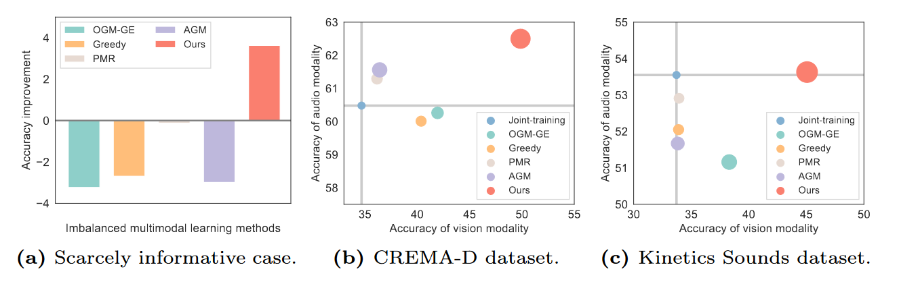

# Diagnosing and Re-learning for Balanced Multimodal Learning

### 一句话概括

> [!IMPORTANT]
>
> 通过分别在训练数据集和测试数据集上运用聚类方法来判别不同encoder的训练状态，并通过重新初始化其中的部分参数来保持不同模态的训练平衡。

### 文章思路流程

1. #### 待解决问题：

   > 不同的模态会以不同的速度converge，这会导致训练端到端的多模态模型时会有一些模态并没有被完全训练，造成模型能力下降。

2. #### 先前方法

   

   - **Gradient Blending**

   - **Distilling**

   - **OGM**（此文章解析详见“25_02_24 OGM”文章中的解析）

   > 但是这些方法都会在一定程度上损失某一较强模态的能力

3. #### 解决方法

   - *Preliminary*

     > Recent studies suggest that re-initializing the network parameters during training can effectively improve model performance and parameter utilization

   - *总体流程*

   

   1. 先将不同模态的encoding对样本进行操作，记录结果：
      $$
      \phi_i^k=\theta_k(x_i^k)
      $$

      $$
      \phi_D^k=\{\phi_1^k,\phi_2^k,\dots,\phi_{N_{D}}^k\}
      $$

      

   2. 对每一个模态的训练集和测试集${\phi}$分别做聚类，计算purity，然后拿到两者之差，来代表这个模态的学习程度
      $$
      g^k=|P_D^k-P_V^k|
      $$

   3. 根据这个量化的学习程度，来动态的遗忘encoding内容（重新initialize）
      $$
      \alpha_k = \tanh(\lambda \cdot g^k)
      $$

      $$
      \theta_k = (1 - \alpha_k) \cdot \theta_k^{\text{current}} + \alpha_k \cdot \theta_k^{\text{init}}
      $$

      

4. #### 方法亮点

   - [ ] 将工作从之前的双模态推广到了n模态

   - [ ] 不会损失较优的模态的encoding能力（实验结果上看来是这样的，但是数学推导上存疑）
   - [ ] 理论上可以增强模型的泛化能力

### 实验结果

### 思考

回顾下训练的整个过程，**初始化参数**，**批次训练数据**，**计算loss**，**反向传播**，**更新参数**

现在看的三篇文章，分别对应着：更新参数（On-the-fly Gradient Modulation）、计算loss（MMPARETO）、再计算过程中重新初始化参数（Diagnosing and Re-learning）

如果我希望再不影响多模态模型端到端训练优势的情况下，能平衡不同模态之间的收敛速度，现在有下面几点思考：

1. **从批次训练数据考虑：**启发于Diagnosing and Re-learning这篇文章中，前期为了验证目前方法会影响另一个较好模态的能力，而在数据集里加了噪声这一点，看到了一些模型的表现下降。

   **所以数据质量，或者抽象的来说数据中不同模态的信息密度，会对多模态模型的学习产生影响。**

   基于此，我认为可以从已有数据出发，用类似CDA（反事实增强）的方法，构建出一批和原始数据集相似，但是在某一模态上进行削弱的数据集（比如图片分辨率，音频加噪声）。在模型动态的识别出训练时的不平衡时，将下一个输入的batch换成近似的，但是在较强模态上进行削弱的数据以期弥补。

2. **从初始化参数考虑：**如果说在训练的时候不断按一定比例重新初始化参数能提升模型的泛化性和公平性，一个好的初始化参数也自然可以一定程度上保证训练过程的平衡。

   所以，是否可以考虑使用meta learning的方法来做数据初始化（比如最简单的MAML），用一些已知的平衡小任务来学习一个平衡的参数初始值

同样，在看了lab相关文章之后，我也有一些疑问希望解答：

1. 为什么在Diagnosing and Re-learning和On-the-fly Gradient Modulation两篇文章上，在相同数据集中对gradient blending的实验结果有差异？如果两者用的实验代码不一样，具体在什么方面？
2. Diagnosing and Re-learning中说这篇文章里的方法能避免不同模态模型能力保持平衡的时候得到损失，结果也能验证这一点，但是我没有在推导中看到这个现象的理论解释，不太清楚我是否遗漏了些什么

总的来说，我认为这个任务的核心就是找出一个罚函数，再用一定方法对这个罚函数进行补偿。
