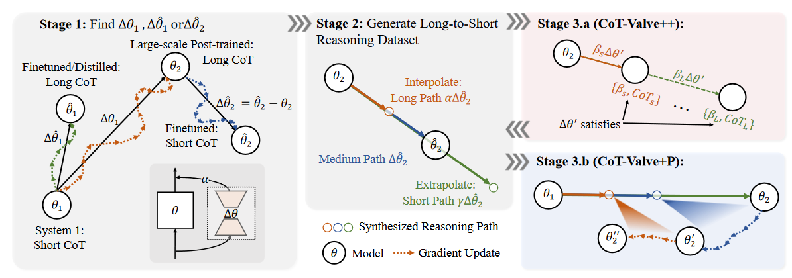
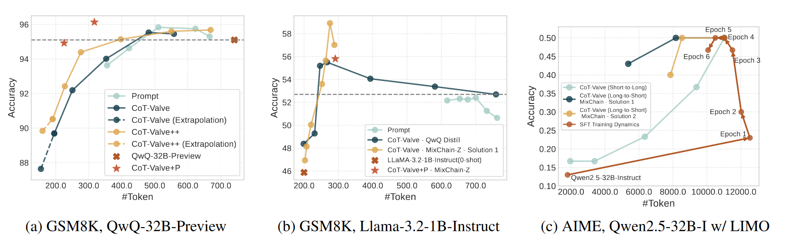

# CoT-Valve: Length-Compressible Chain-of-Thought Tuning

### 一句话概括

> [!IMPORTANT]
>
> 提出**CoT-Valve**来有效控制模型的输出长度，涉及到了lora微调控制，相关数据集构建与精细化训练方法设计。

### 文章思路流程

1. #### 待解决问题：

   > CoT在带来效果提升的同时让token耗费显著加大。文章认为其中有一部分推理过程是不必要的

2. #### 先前方法

   - **distill the chain-of-thought**

   - **internalizing reasoning steps within the hidden states**

   - **compress token-wise generation**

   - **summarization techniques**

   - **merging model**

   > pdf附在了同目录文件夹*related paper*中

3. #### 文章贡献

   

   1. 优化公式
      $$
      \max_{\Delta\theta} \mathbb{E}_{(q,a) \sim \mathcal{D}\mathcal{P}} (a | t_1, \ldots, t_m; q; \theta + \Delta\theta) \prod_{i=1}^{m} p(t_i | t_{<i}, q; \theta + \Delta\theta) \quad
      $$
   
      > 简要解释就是在不影响最终输出结果的情况下，最大化更少推理步骤的概率
   
   2. 基于lora的可控优化
   
      考虑训练两个模型，一个模型生成较短的不含推理过程的回答，加上lora训练参数之后变成能生成长文本的模型，在merge阶段通过控制lora参数的ratio来得到连续变化的模型回答偏好。

   3. MixChain Dataset**（如果开源的话应该是这篇文章最重要的借鉴意义了）**
   
      由于**2**的方法给出了可控的模型，考研根据这些模型对同一个问题的不同回答组合成新的数据集

   4. 更细粒度CoT-Valve

      如图3.a和3.b所示，希望对原始优化公式进行改写：
   
      - **CoTValve++**
        $$
        \max_{\Delta\theta} \mathbb{E}_{(q,a) \sim \mathcal{D}\mathcal{P}} (a | t_1, \ldots, t_m; q; \theta + \beta\Delta\theta) \prod_{i=1}^{m} p(t_i | t_{<i}, q; \theta + \beta\Delta\theta) \quad
        $$
        希望训练过程中能保证控制参数${\alpha}$不为0或者1的时候的推理效果
   
      - **CoT-Valve+P**

        多步逼近最终的优化结果（学习多个${\theta}$），可以仿照**VAE**和**DDPM**两者的关系。
   
4. #### 方法亮点

   - [ ] 用比较小的训练代价实现了可控的模型输出长度控制

   - [ ] 构建了新的benchmark —— MixChain Dataset，以及新的matric——ACU
     $$
     \text{ACU} = \frac{\text{Accuracy}}{\#\text{Params} \times \#\text{Tokens}}
     $$
     

### 实验结果

### 思考

1. 第一步中的${\Delta\theta}$的训练过程在method里阐述的不是很清晰，也就是不清楚怎么拿到两个生成不同推理长度的模型

2. 产生较短的CoT是不是能看成模型输出的一种**风格**

   > 相关文章：LatentQA: Teaching LLMs to Decode Activations Into Natural Language
   >
   > 内容：如何通过调整模型内部参数让llm生成风格化内容的，具体是通过训练一个具有这种风格的小模型，然后取出我需要添加风格的大模型的某一层参数向小模型参数更新

3. 作者追踪：

   > 1. Xinyin Ma
   >
   >    先前做的工作主要是关于diffusion模型架构优化和多模态的
   >
   > 2. Runpeng Yu
   >
   >    主要关于GNN与CV
   >
   > 3. Gongfan Fang
   >
   >    主要关于生成式模型，也有大模型剪枝的工作
   >
   > 4. Xinchao Wang

   好像么有找到他们组在这个方向上的连续工作
