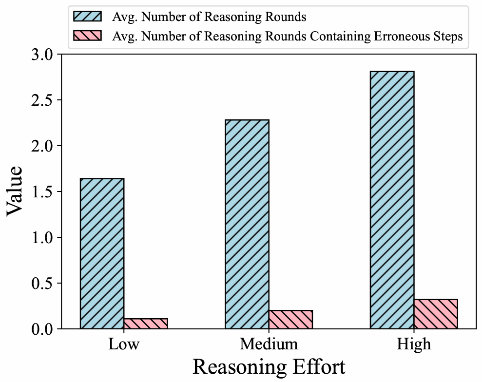

# Flexible_reasoning

### 相关文章;

- [CoT-Valve: Length-Compressible Chain-of-Thought Tuning](https://arxiv.org/pdf/2502.09601)
- [Towards Thinking-Optimal Scaling of Test-Time Compute for LLM Reasoning](https://arxiv.org/pdf/2502.18080)
- [TokenSkip: Controllable Chain-of-Thought Compression in LLMs](https://arxiv.org/pdf/2502.12067)
- [Inner Thinking Transformer: Leveraging Dynamic Depth Scaling to Foster Adaptive Internal Thinking](https://arxiv.org/pdf/2502.13842)
- [Distilling System 2 into System 1](https://arxiv.org/pdf/2407.06023)
- [From Explicit CoT to Implicit CoT: Learning to Internalize CoT Step by Step](https://arxiv.org/html/2405.14838v1)
- [IMPLICIT CHAIN OF THOUGHT REASONING  VIA KNOWLEDGE DISTILLATION](https://arxiv.org/pdf/2311.01460)
- [LATENTQA: TEACHING LLMS TO DECODE  ACTIVATIONS INTO NATURAL LANGUAGE](https://arxiv.org/pdf/2412.08686)

### 基本问题

1. 传统CoT在提升效能的同时会显著提升token消耗

2. 如果思维长度过长，则会导致redundancy或者错误推理步骤

   

### 目前的方法

1. 一种是基于蒸馏的方法，代表文章有：
   - [TokenSkip: Controllable Chain-of-Thought Compression in LLMs](https://arxiv.org/pdf/2502.12067)
   
     > $$
     > I_2(x_i)=P(x_i|x_{\leqslant n};\theta_{M_B})
     > $$
     >
     > 用这个公式来挑选出其中冗余的思维过程，去除之后重新训练
   
   - [Towards Thinking-Optimal Scaling of Test-Time Compute for LLM Reasoning](https://arxiv.org/pdf/2502.18080)
   
     > 针对相同模型对于不同prompt的CoT响应结果，来重新微调模型
   
   - [Distilling System 2 into System 1](https://arxiv.org/pdf/2407.06023)
   
2. 一种是通过特定的模型设计，比如增加模块或者构建特定的训练方法来让模型生成更短更精确的思维链（或者看作隐藏层而不输出），代表文章有：
   - [CoT-Valve: Length-Compressible Chain-of-Thought Tuning](https://arxiv.org/pdf/2502.09601)
   
     > 使用了lora来达到了连续的cot长度控制
   
   - [Inner Thinking Transformer: Leveraging Dynamic Depth Scaling to Foster Adaptive Internal Thinking](https://arxiv.org/pdf/2502.13842)
   
     > 通过在tranformer中增加隐藏层来避免模型对某些token induce abrupt gradient spikes across layers
   
   - [IMPLICIT CHAIN OF THOUGHT REASONING  VIA KNOWLEDGE DISTILLATION](https://arxiv.org/pdf/2311.01460)
   
   - [From Explicit CoT to Implicit CoT: Learning to Internalize CoT Step by Step](https://arxiv.org/html/2405.14838v1)
   
     > 这两篇引入了IMPLICIT COT的概念，也就是模型在训练的时候使用思维链，但是作为隐藏层信息，在最后推理的时候不输出

### 思考

1. **对于第一类方法：**

   - 此类方法的重点是通过一定方法（**公式**、**人为标注**）来删去被蒸馏模型的长文本输出中不必要的或者出错的部分，用余下的高质量数据集来重新训练模型；

   - 是否可以用端到端的方法来代替人工或者公式挑选的过程，比如参照GAN类似的做法，这里可以分为两个情况：

     1. 如果我们希望从头训练一个模型，在一段时间的自监督学习之后，可以引入一个**判别器**（判别输出的思维链是否冗余或错误），人为设计其loss，用来在训练过程中影响模型偏好。（带判别器的过程和常规自监督可以交替进行）

     2. 更多情况下，我们希望利用已有的模型的知识，再不耗费资源重新训练的情况下进一步增强。这里我们可以将判别器和原始模型分开训练，通过提供**良好的判别器ckpt**（用它和已有模型进行少轮数ft）来实现**即插即用**的端到端方法。

     

2. **目前的方法缺少能让模型自己决定输出长度的工作：**

   - 上述的调研结果基本都聚焦于缩减COT长度来提高effciency，但是都没有让模型自己决定输出长度的设计
   - 可能的方法：
     1. 在判别器的设计上做工作，比如增大对最终答案是否正确的loss占比
     2. [CoT-Valve: Length-Compressible Chain-of-Thought Tuning](https://arxiv.org/pdf/2502.09601)在这篇工作的基础上，让控制lora的${\alpha}$变成可学习的。
