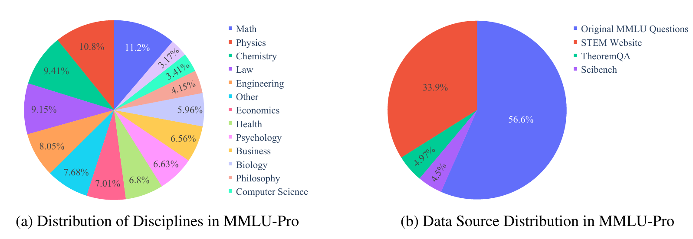
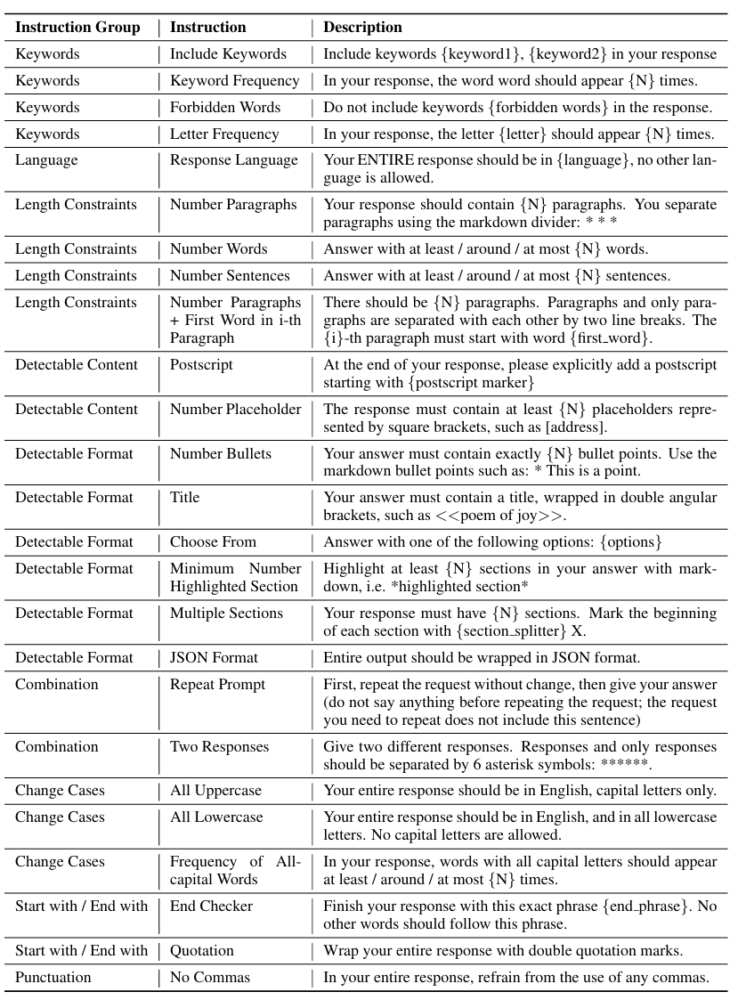
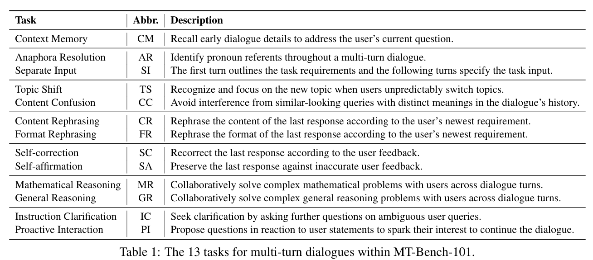
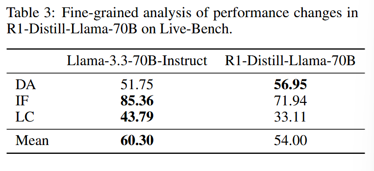
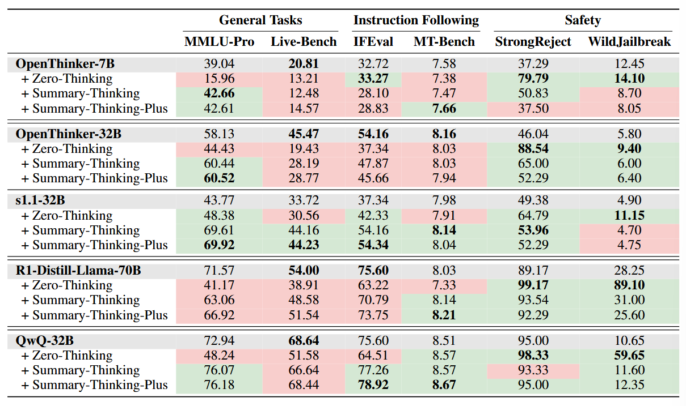

# Trade-offs in Large Reasoning Models: An Empirical Analysis of Deliberative and Adaptive Reasoning over Foundational Capabilities

### 一句话概括

> [!IMPORTANT]
>
> 通过在模型能力，模型安全，模型指令跟随等方面的benchmark测试，得出了LRM可能比其基础模型在一些基本能力上更弱。

### HINT

> 1. Acquiring deliberative reasoning capabilities significantly reduces the foundational capabilities of LRMs, along with substantially increased inference costs.
> 2. Adaptive reasoning significantly enhances LRMs performance across diverse tasks.

### Benchmark列举

1. Helpfulness

   - MMLU-Pro

     > MMLU的增强版本，选项变多，问题变多
     >
     > including Biology, Business, Chemistry, Computer Science, Economics, Engineering, Health, History, Law, Math, Philosophy, Physics, Psychology, and Others.

     

   - Live-Bench

     > contains a set of 18 diverse tasks across 6 categories
     >
     > 定期更新

2. Instruction-following

   - IFEval

     

   - MT-Bench

     > 多轮对话

     

3. Harmlessness

   - StrongReject

     > Jailbreak工作

   - WildJailbreak

### 实验结果

- **概括**

  > 1. Incorporating deliberative reasoning into LRMs significantly diminishes their foundational capabilities, negatively impacting both helpfulness and harmlessness.
  > 2. LRMs incur significant inference-time overhead when performing general tasks.

- **LRM**

  在Data Analysis任务上有提升，但是在Instruction following和Language Comprehension上有降低

  在安全方面集体下降

  作者认为可能的原因是thinking process中的不合理提示导致的

  

- Adaptive reasoning

  生成越长，General Tasks效果越好，Instruction Following和Safety能力越差

  

### 思考

1. 这里的benchmark后续可以用到
2. 注意think里面的第一句可能对模型生成有很大影响
